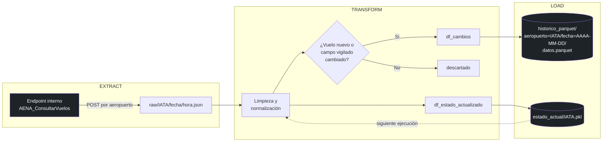

<div align="center">

# ✈️ AENA-ETL

### Pipeline de datos en tiempo real de los 11 principales aeropuertos de España


**Extrae, limpia y versiona el estado de cada vuelo de salida de AENA cada 10 minutos**, convirtiendo el "estado en directo" de los paneles de los aeropuertos en un histórico estructurado y analizable.

</div>

---

## 📡 ¿Qué resuelve este proyecto?

Los paneles de salidas de los aeropuertos (y la web de AENA) muestran el estado de un vuelo *en el instante presente*, pero no guardan memoria de cómo ha evolucionado: a qué hora se anunció el retraso, cuánto tardó en abrirse la puerta de embarque, cuándo cambió el mostrador de facturación. Esa información se pierde en cuanto el panel se actualiza.

**AENA-ETL** resuelve esto sondeando el endpoint interno de AENA cada 10 minutos para los **11 aeropuertos con más tráfico de España** y quedándose solo con lo que de verdad importa: los vuelos nuevos y los campos que han cambiado desde la última vez. El resultado es un histórico incremental, ligero y consultable de la evolución operativa de cada vuelo — sin necesidad de infraestructura de servidores, bases de datos gestionadas ni almacenamiento en la nube: todo el pipeline vive y se ejecuta dentro de GitHub Actions.

---

## 🏗️ Arquitectura del pipeline

El pipeline sigue un patrón **Extract → Transform → Load** clásico, orquestado por `main.py` y disparado por un *cron* de GitHub Actions:



### Extract
- **Fuente:** endpoint interno no documentado que usa la propia web de AENA (`aena.es/es/infovuelos.html`) para pintar el panel de salidas — no requiere API key.
- **Volumen:** 11 llamadas por ejecución (una por aeropuerto), con reintentos automáticos (`MAX_REINTENTOS=2`) y *timeout* de 8s por llamada. Una pausa de 1s entre aeropuertos evita saturar el endpoint.
- **Salida:** JSON crudo, sin transformar, en `raw/<IATA>/<AAAA-MM-DD>/<HH-MM-SS>.json` — particionado por aeropuerto y día para que el archivado/limpieza sea trivial. Esta carpeta es efímera: solo existe dentro de la misma ejecución del *runner*.

### Transform
- Aplana el JSON a un `DataFrame` de `pandas` y construye una **clave única por vuelo** (`aeropuerto_numVuelo_fecha_horaProgramada_destino`) válida para todo el día y para cualquiera de los 11 aeropuertos.
- Normaliza fechas (`fecha`/`horaProgramada` → `datetime`), guarda un mostrador combinado (`mostradorDesde-mostradorHasta`) y traduce los códigos de estado de AENA (`BOR`, `CER`, `EMB`...) a una descripción legible.
- Compara la extracción nueva contra el último estado conocido **de ese mismo aeropuerto** (nunca se mezclan aeropuertos entre sí) y se queda solo con los vuelos nuevos o con cambios en los campos vigilados: `estado`, `puerta`, `salida_estimada`, `mostrador`, `terminal`, `tipo_aeronave`.
- Trata `NaN`/`NaT` como iguales entre sí en la comparación — sin este detalle, dos vuelos sin hora estimada todavía generarían un "cambio" falso en cada ejecución.

### Load
- Escribe **solo las filas de cambio** en el histórico, ahora almacenado en **Parquet particionado al estilo Hive**: `data/historico_parquet/aeropuerto=<IATA>/fecha=<AAAA-MM-DD>/datos.parquet`.
- Para evitar generar miles de archivos diminutos (que acaban rompiendo repositorios Git y sistemas de archivos), cada ejecución **consolida la partición del día**: lee el `datos.parquet` existente (si lo hay), concatena las filas nuevas y sobrescribe el archivo. Si no hay cambios, no se toca ninguna partición.
- Sobrescribe la "foto completa" de cada aeropuerto en `data/estado_actual/<IATA>.pkl` (formato *pickle* para conservar tipos `datetime` exactos entre ejecuciones), que sirve de punto de comparación para la siguiente ejecución del Transform.

---

## 🌍 Alcance: los 11 aeropuertos monitorizados

| IATA | Aeropuerto | Pasajeros 2025 (aprox.)* |
|:----:|---|--:|
| **MAD** | Adolfo Suárez Madrid-Barajas | 68,2 M |
| **BCN** | Barcelona-El Prat | 57,5 M |
| **PMI** | Palma de Mallorca | 33,8 M |
| **AGP** | Málaga-Costa del Sol | 26,8 M |
| **LPA** | Gran Canaria | 15,8 M |
| **TFS** | Tenerife Sur | 14,0 M |
| **VLC** | Valencia | 11,8 M |
| **SVQ** | Sevilla | 9,7 M |
| **TFN** | Tenerife Norte | 7,2 M |
| **SCQ** | Santiago de Compostela | ~2,5 M |
| **MAH** | Menorca | ~3 M |

<sub>*Fuente: notas de prensa de AENA, cierre de tráfico 2025 (aena.es/es/prensa). Cifras de pasajeros totales del aeropuerto, no solo de salidas.</sub>

Por cada vuelo de salida capturado se extraen: **número de vuelo, aerolínea (IATA y nombre), destino (IATA y ciudad), hora programada/estimada, estado (facturación / embarque / última llamada / cerrado / retrasado / cancelado...), terminal, puerta y mostrador de facturación.**

---

## 🛠️ Tech stack y decisiones de diseño

| Rol | Herramienta |
|---|---|
| Lenguaje y procesamiento | **Python 3.12** + **pandas** |
| Cliente HTTP | **requests** (con reintentos manuales) |
| Orquestación / *scheduling* | **GitHub Actions** (`repository_dispatch` / `workflow_dispatch` en cron externo) |
| Persistencia de estado | **Pickle** (`estado_actual/*.pkl`) por aeropuerto |
| Almacén de histórico | **Parquet particionado** al estilo Hive (`aeropuerto=IATA/fecha=AAAA-MM-DD/datos.parquet`) vía **pyarrow** |
| Control de versiones de los datos | **Git** — cada ejecución hace commit de `data/` si hubo cambios |

**Por qué esta pila y no otra:** el volumen de datos (11 llamadas cada 10-15 min, decenas de filas de cambio por ejecución) no justifica el coste operativo de un *data warehouse* gestionado, un orquestador como Airflow o un contenedor Docker persistente. GitHub Actions ya ofrece *scheduling*, cómputo efímero y almacenamiento (el propio repositorio Git) sin coste ni mantenimiento adicional, y pandas es más que suficiente para el volumen manejado. Esta es una decisión de **escala apropiada**, no una limitación: el diseño modular de `extract.py` / `transform.py` / `load.py` ya ha permitido sustituir el CSV *append-only* original por Parquet particionado (ver [Roadmap](#-roadmap-y-estado-del-proyecto)) sin tocar la lógica de negocio de Extract ni Transform, y permitiría igualmente sustituir el pickle por PostgreSQL el día que el volumen lo justifique.

---

## 🗃️ Modelo de datos y calidad

**`data/historico_parquet/`** — histórico incremental de cambios, particionado por `aeropuerto` y `fecha` (una fila por evento detectado):

```
data/historico_parquet/
├── aeropuerto=MAD/
│   ├── fecha=2026-09-14/datos.parquet
│   └── fecha=2026-09-15/datos.parquet
├── aeropuerto=BCN/
│   └── fecha=2026-09-14/datos.parquet
...
```

| Columna | Tipo | Descripción |
|---|---|---|
| `clave_vuelo` | str | `aeropuerto_numVuelo_fecha_horaProgramada_destino` — identificador único del vuelo |
| `aeropuerto` | str | Código IATA de origen |
| `num_vuelo`, `iata_compania`, `aerolinea` | str | Identificación del vuelo y aerolínea |
| `destino_iata`, `destino_ciudad` | str | Destino del vuelo |
| `salida_programada`, `salida_estimada` | datetime | Horas programada y estimada |
| `estado`, `estado_desc` | str | Código de AENA y descripción legible |
| `terminal`, `puerta`, `mostrador`, `tipo_aeronave` | str | Detalles operativos |
| `detectado_en` | datetime | Instante en que el pipeline detectó el cambio |

El particionado por `aeropuerto`/`fecha` permite leer solo lo necesario con `pandas.read_parquet()` (o cualquier motor compatible con particiones Hive, como DuckDB), en vez de cargar el histórico completo en memoria:

```python
import pandas as pd

# Solo el histórico de Sevilla del 14 de septiembre de 2026
df = pd.read_parquet("data/historico_parquet/aeropuerto=SVQ/fecha=2026-09-14/")

# Todo el histórico disponible (todas las particiones)
df_todo = pd.read_parquet("data/historico_parquet/")
```

**`data/estado_actual/<IATA>.pkl`** — última foto completa de todos los vuelos vistos de ese aeropuerto (uso interno, no pensado para lectura directa).

**Reglas de calidad implementadas:**
- **Deduplicación** por `clave_vuelo` dentro de cada extracción (`drop_duplicates`).
- **Aislamiento estricto por aeropuerto**: el estado de un aeropuerto nunca se compara ni se mezcla con el de otro.
- **Comparación robusta de nulos**: `NaN`/`NaT` se tratan como iguales entre sí para no generar falsos positivos de "cambio" en vuelos sin hora estimada todavía.
- **Tolerancia a fallos por aeropuerto**: si falla la extracción de uno, el resto continúa; el aeropuerto fallido simplemente no actualiza su estado en esa ejecución.
- **Reintentos de red** (hasta 2 intentos, con espera entre ellos) y manejo explícito de `JSONDecodeError` si AENA responde con contenido no válido.
- **Consolidación de particiones**: en vez de añadir un archivo Parquet nuevo por ejecución, cada corrida reescribe la partición del día combinando lo existente con los cambios nuevos, manteniendo acotado el número de archivos por aeropuerto/día.

---

## 🚀 Quickstart

**Prerrequisitos:** Python 3.12+

```bash
# 1. Clonar el repositorio
git clone https://github.com/ignblabla/AENA-data-pipeline.git
cd AENA-data-pipeline

# 2. Crear entorno virtual e instalar dependencias
python -m venv venv
source venv/bin/activate      # En Windows: venv\Scripts\activate
pip install -r requirements.txt

# 3. Ejecutar el pipeline completo (Extract -> Transform -> Load)
python main.py
```

Tras la ejecución, revisa `data/historico_parquet/` (cambios detectados, particionados por `aeropuerto`/`fecha`) y `data/estado_actual/` (foto completa por aeropuerto). No se necesita ninguna clave de API ni variable de entorno.

Para que se ejecute solo cada 10-15 minutos sin intervención, el repositorio ya incluye el workflow `.github/workflows/etl.yml`, que instala dependencias, corre `main.py` y hace commit/push de `data/` automáticamente si hubo cambios.

> 📎 El repositorio incluye además `migrar_a_parquet.py`, un script de un solo uso ya ejecutado que migró el histórico original en `historico_vuelos.csv` al formato Parquet particionado actual. Se mantiene en el repo como referencia, pero no forma parte del pipeline recurrente.

---

## 📊 Insights (muestra del histórico acumulado)

> Por completar

---

## 🗺️ Roadmap y estado del proyecto

**Implementado**
- [x] Extracción resiliente de los 11 aeropuertos con reintentos y aislamiento de fallos
- [x] Detección incremental de cambios por vuelo (sin duplicar el histórico completo en cada ejecución)
- [x] Persistencia de estado por aeropuerto y ejecución automática vía GitHub Actions
- [x] Manejo correcto de valores nulos/nunca-informados (`NaT`)
- [x] Migrar `historico_vuelos.csv` a Parquet particionado por aeropuerto/día para reducir el peso del repositorio a medida que crece el histórico

**Próximos pasos**
- [ ] Añadir tests automatizados (`pytest`) para `extract`, `transform` y `load`
- [ ] Dashboard de seguimiento (Streamlit o Grafana) sobre el histórico acumulado
- [ ] Modelo de predicción de retrasos a partir del histórico de cambios de estado
- [ ] Alertado de retrasos relevantes vía Telegram/Slack
- [ ] Ampliar a vuelos de **llegada**, no solo de salida

---

## 📄 Licencia

Distribuido bajo licencia [Apache 2.0](LICENSE).